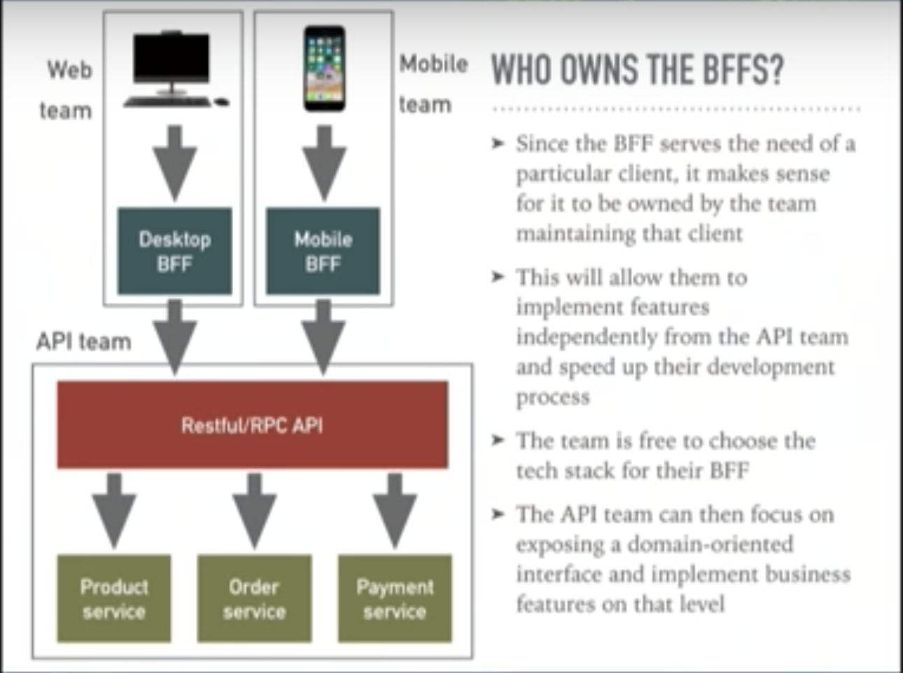
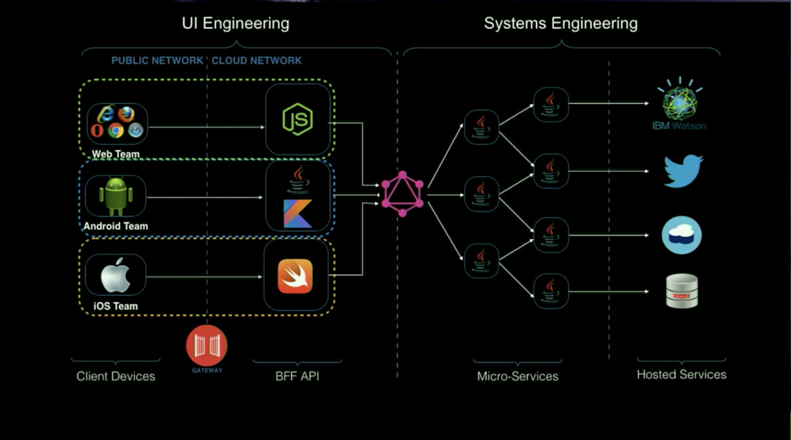
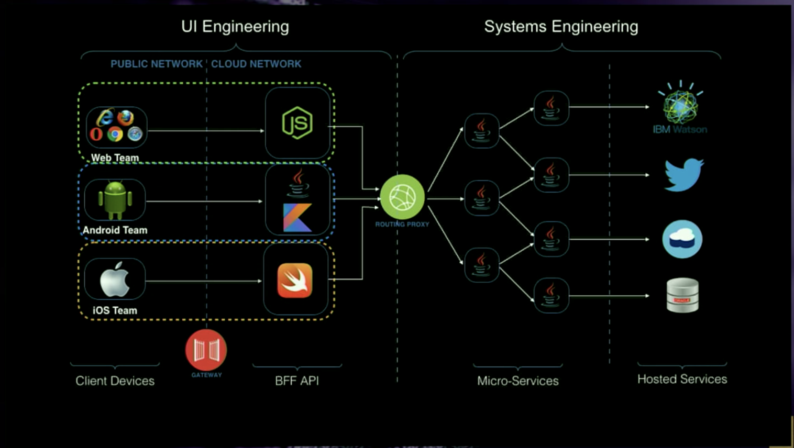

# graphql-java-provider-codegen-gradle-plugin
根据graphql endpoint、SDL、AST.json、@graphql注解的java类生成服务端POJO、Resovers、api等辅助java类gradle plugin

# ui-team 

- 前端团队拥有并负责开发BFF，可以采用同一样的技术栈如小程序前端采用H5、javascript，BFF采用nodejs
- 前端团队专注用户界面与用户体验而无需等待业务逻辑实现团队提供的api
- 这样减少与业务逻辑实现团队沟通，在还没有业务逻辑api之前，前端团队自己可以在BFF完全MOCK数据来支持用户界面或用户体验的开发

# bi-team  


- 后端团队拥有并负责业务智能逻辑的api实现、微服务、数据存储、工作流等, 
- 后端团队专注业务流程、系统安全、强壮性等的实现 
- 后端团队关注数据完整性、关联性以满足各种前端团队需要实现的业务场景


# [Ok Google, how to add git submodule external library gradle android](https://medium.com/@alteromusica/git-submodule-gradle-shared-library-d40383403b59)

1. 添加git submodule
```shell script
git submodule add https://github.com/covid19angels/doper-graphql-gateway.git

git submodule add https://github.com/covid19angels/kgis-datalake-dgraph.git
```

2. 修改settings.gradle
```shell script

pluginManagement {
    repositories {
        mavenLocal()
        gradlePluginPortal()
    }
}

rootProject.name = 'bi-team'

include ':doper-graphql-gateway'
project(':doper-graphql-gateway').projectDir = new File(settingsDir, './doper-graphql-gateway')

include ':kgis-datalake-dgraph'
project(':kgis-datalake-dgraph').projectDir = new File(settingsDir, './kgis-datalake-dgraph')

```

# CloudEvents
我们用cloudevents格式传值,所有系统的事件传递格式就有规范了
- https://github.com/cloudevents/sdk-go/
- https://github.com/alibaba/alibaba-rsocket-broker/blob/master/example/rsocket-requester/src/main/java/com/alibaba/spring/boot/rsocket/demo/OpsController.java
- 阿里的rsocket broker https://github.com/alibaba/alibaba-rsocket-broker/releases
基于标准的CloudEvents格式进行事件推送，同时增加了事件处理后回发确认的机制，方便进行数据验证